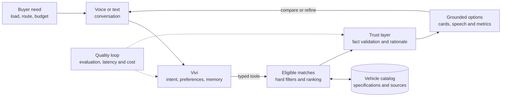

# Vivi: Voice-first Commercial Vehicle search

[](https://github.com/KayvanShah1/conversational-commercial-vehicle-search/actions/workflows/test-publish-container.yaml)
[](docs/EVALUATION.md)
[](docs/DATA_GENERATION.md)
[](docs/SETUP.md)
[](docs/TECHNICAL_DECISIONS.md#correctness-boundaries)
[](https://conversational-commercial-vehicle-search.onrender.com/)
[](LICENSE)


Vivi is a voice-first search and decision-support prototype for India's used commercial-vehicle market. It helps owner-operators, small businesses, and fleet buyers describe what they need in English or Hinglish, refine their requirements over multiple turns, and get a ranked shortlist based on catalog data.

Commercial-vehicle discovery is a constraint-heavy decision: the right choice depends on payload, operating conditions, price, mileage, condition, and paperwork, while buyers may not know the catalog terminology. Vivi reduces that friction through a multi-turn conversation that can clarify requirements, apply hard filters, compare eligible vehicles, and explain why each result fits. The same pattern could support vehicle marketplaces, dealership websites, and assisted sales or financing journeys.

## Try the live demo

**[Open Vivi in your browser](https://conversational-commercial-vehicle-search.onrender.com/)** and start with a text or voice request. No local setup is required.

## Highlights

- **Stateful conversation:** understands budgets, payloads, vehicle sizes, fuels, body types, and locations, and remembers them across corrections and follow-up questions.
- **Deterministic matching:** keeps hard filters intact, ranks eligible vehicles with a fixed formula, and never relaxes requirements silently.
- **Grounded recommendations:** the model calls typed tools instead of querying the database directly or generating SQL, and every vehicle fact is checked against catalog records before reaching the user.
- **Layered observability:** the UI shows filters, ranking scores, tool calls, latency, tokens, and estimated cost. Structured logs capture runtime operations, while optional OpenAI Agents SDK traces group each chat with its turns and spans.
- **Resilient voice path:** Groq handles speech and model inference, with bounded retries across configured API keys and fallback models.
- **Executable evaluation:** 46 cases test conversation, safety, catalog discovery, vehicle variants, attribute lookup, pagination, and preference changes.

> All catalog listings are synthetic and are not live marketplace inventory.

## Run locally

### Run the published container

You need Docker, a MotherDuck token, and at least one Groq API key. Create `.env` from [`example.env`](example.env), then set these required values:

```dotenv
MOTHERDUCK__TOKEN=<API_TOKEN>
GROQ__API_KEYS=["<API_KEY>"]
```

Pull the latest published image and start the app:

```console
docker pull ghcr.io/kayvanshah1/conversational-commercial-vehicle-search:latest
docker run --rm --name vivi --env-file .env -p 8501:10000 ghcr.io/kayvanshah1/conversational-commercial-vehicle-search:latest
```

Open <http://localhost:8501>. The container stores session data only for its lifetime; add `-v vivi-sessions:/app/data/sessions` to the `docker run` command if you want sessions to persist between containers.

### Use Docker Compose

The included [`compose.yml`](compose.yml) builds the application image from this repository, loads `.env`, and keeps session data in a named volume:

```console
docker compose up --build
```

Open <http://localhost:8501>. Stop the application with `Ctrl+C`, then remove its containers and network with:

```console
docker compose down
```

The `vivi-sessions` volume is retained so conversations survive container recreation.

### Run from source

You need [uv](https://docs.astral.sh/uv/), a MotherDuck token, and at least one Groq API key.

```powershell
Copy-Item example.env .env
# Add MOTHERDUCK__TOKEN and GROQ__API_KEYS to .env.

uv sync --all-packages --dev
uv run python -m vehicle_catalog_generator.load
uv run --package app streamlit run app/main.py
```

Open <http://localhost:8501>. The bottom composer accepts text or microphone input, and both modes share the same conversation state.

See the [setup guide](docs/SETUP.md) for prerequisites, credential links, every environment variable, troubleshooting, and verification commands.

## Try the conversation

Use these turns in one session:

1. `Chhota truck chahiye, 5 lakh ke andar, city delivery ke liye.`
2. `Nahi, diesel nahi, CNG.`
3. Ask for an impossible combination to see a grounded zero-result relaxation.
4. `Second one ka payload aur GVW kya hai?`

For a terminal-only conversation:

```powershell
uv run --package agents python analysis/agent_chat.py
```

## System overview



The buyer gets a natural conversation and comparable options; the application turns requirements into decision support; and deterministic search, typed tools, provenance, and response validation keep the underlying facts controlled. See the wiki for the detailed [component architecture](https://github.com/KayvanShah1/conversational-commercial-vehicle-search/wiki/Architecture-and-Technical-Decisions) and [conversation, tool, state, and grounding workflow](https://github.com/KayvanShah1/conversational-commercial-vehicle-search/wiki/Agent-Behavior-and-Grounding).

## Evaluation

| Suite | Coverage | Latest live result |
| --- | --- | ---: |
| Core | Conversation, intent, slots, safety, corrections, and follow-ups | **28/28 (100%)** |
| Vehicle variants | Sizes, bodies, fuels, categories, attributes, and pagination | **18/18 (100%)** |
| Voice pipeline | STT, agent behavior, catalog search, grounding, TTS, and latency | **3/3 (100%)** |
| All suites | 46 text cases and 3 recorded voice cases | **49/49 (100%)** |

All three suites ran through their live provider paths on 2026-09-06 and exceeded the 90% target. Full commands, timings, token usage, and cost boundaries are in the [evaluation report](docs/EVALUATION.md).

## Tech stack

[](https://www.python.org/)
[](https://openai.github.io/openai-agents-python/)
[](https://streamlit.io/)
[](https://motherduck.com/)
[](https://duckdb.org/)
[](https://docs.pydantic.dev/)
[](https://groq.com/)
[](https://pola.rs/)
[](https://docs.astral.sh/uv/)
[](https://pytest.org/)
[](https://docs.astral.sh/ruff/)
[](https://www.docker.com/)
[](https://github.com/KayvanShah1/conversational-commercial-vehicle-search/actions)
[](https://render.com/)

## Documentation

### Start here

| If you want to… | Read |
| --- | --- |
| Browse all repository documentation | [Documentation index](docs/README.md) |
| Install and run Vivi | [Setup guide](docs/SETUP.md) |
| Review the original specification | [Source brief](docs/assignment/README.md) or [PDF](docs/assignment/voice-search-assignment.pdf) |
| Understand the system boundaries | [Architecture and technical decisions](docs/TECHNICAL_DECISIONS.md) |
| Inspect scores and telemetry | [Evaluation report](docs/EVALUATION.md) |
| Check requirement coverage | [Submission checklist](docs/SUBMISSION_CHECKLIST.md) |
| Review catalog construction | [Catalog generation](docs/DATA_GENERATION.md) |
| Audit external references | [Sources and acknowledgements](docs/SOURCES.md) |
| Explore implementation detail | [Project wiki](https://github.com/KayvanShah1/conversational-commercial-vehicle-search/wiki) |
| View the evaluator walkthrough | [Presentation PDF](output/pdf/vivi-vehicle-search-presentation.pdf) |

The repository documentation is optimized for setup and assessment. The wiki contains deeper design, behavior, data-generation, evaluation, and operational explanations.

## Repository layout

```text
agents/                       Agent, tools, search, response, state and voice
app/                          Streamlit voice-and-text demo
vehicle-catalog-generator/    Reproducible synthetic catalog pipeline
utils/                        Shared settings, logging and database access
evals/                        Evaluation package, configuration and datasets
tests/                        Unit and opt-in integration tests
docs/                         Setup, design, evaluation and reference documentation
data/                         Generated catalog and evaluation artifacts
```

## Verify locally

```powershell
uv run ruff check agents app evals tests utils vehicle-catalog-generator
uv run pytest tests -q
```

The live MotherDuck integration test is opt-in. See [Verification](docs/SETUP.md#verification) before enabling it.

## License

Licensed under the [MIT License](LICENSE).

#### Disclaimer

<sub>This is an engineering demonstration, not a live marketplace or purchasing service. The catalog, prices, availability, rankings, and recommendations are synthetic and must not be treated as current commercial offers. Specification links provide provenance for selected reference attributes; confirm specifications, legal requirements, condition, pricing, and suitability with the manufacturer or seller before making a decision.</sub>

#### AI-assisted development

<sub>AI tools supported implementation, refactoring, test design, documentation, and the repository cover image. Product scope, system boundaries, architecture, evaluation criteria, and final verification remained human-directed. AI-generated code and content were reviewed against executable tests, live evaluation cases, catalog-grounding checks, and the documented requirements.</sub>
