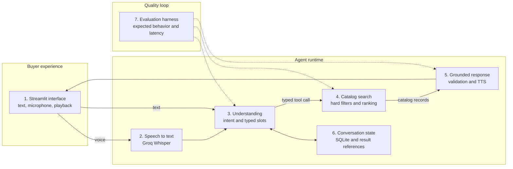
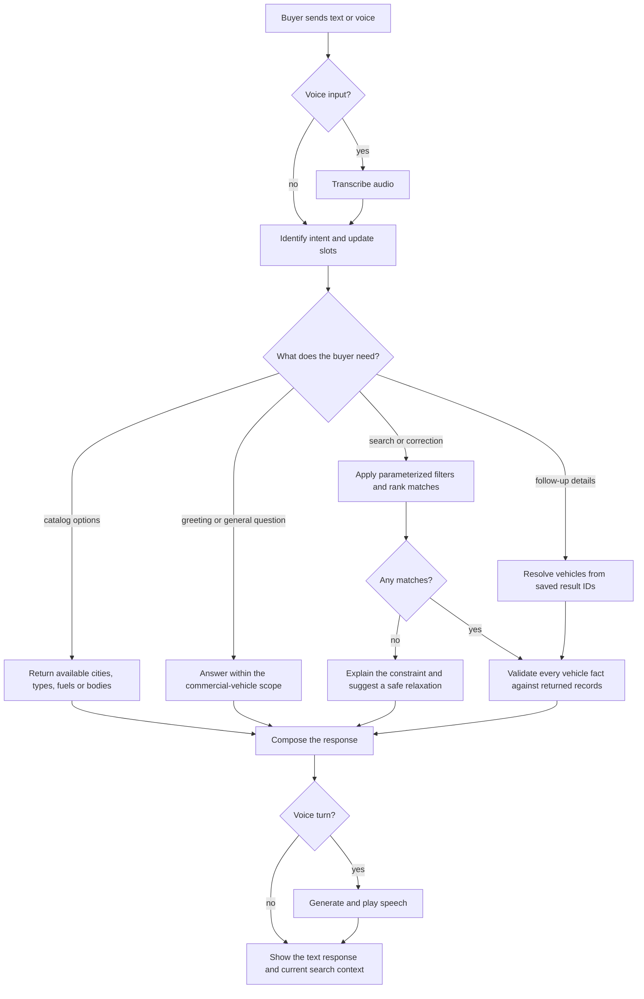

# Vivi: voice-first commercial vehicle search

Vivi is a localhost voice assistant for finding used commercial vehicles. It
accepts microphone or text input, extracts inspectable search constraints,
applies parameterized hard filters to a 1,000-row catalog, ranks matching
vehicles, and speaks a top-three response whose facts are validated against the
returned records.

## Run in under 10 minutes

Prerequisites: Python 3.13, [uv](https://docs.astral.sh/uv/), a MotherDuck token,
and at least one Groq API key. Additional Groq keys are optional and are tried
before the agent changes models. An OpenRouter key enables two more fallbacks.

```powershell
Copy-Item example.env .env
# Fill MOTHERDUCK__TOKEN and GROQ__API_KEYS in .env.
# GROQ__API_KEYS is a JSON list: ["primary-key","secondary-key"]
# Optionally fill OPENROUTER__API_KEY.

uv sync --all-packages --dev
uv run python -m vehicle_catalog_generator.load
uv run --package app streamlit run app/main.py
```

Open <http://localhost:8501>. The bottom composer includes text, microphone,
and send controls. Record and submit a voice turn, then allow browser audio
playback. Text uses the same conversation state and remains available if
microphone permission or a voice provider is unavailable.

The repository includes the deterministic 1,000-row catalog at
`data/generated/vehicles.csv`. Loading is idempotent by default; set
`DATA_GENERATION__REPLACE=true` only when intentionally replacing an existing
MotherDuck table.

## Demo path

Use these four turns in one session:

1. `Chhota truck chahiye, 5 lakh ke andar, city delivery ke liye.`
2. `Nahi, diesel nahi, CNG.`
3. Ask an intentionally impossible combination to show zero-result relaxation.
4. `Second one ka payload aur GVW kya hai?`

The page keeps active slots, grounded results, and per-stage latency visible.
For a terminal-only fallback:

```powershell
uv run --package agents python analysis/agent_chat.py
```

## Evaluation

The core evaluation contains 23 conversational, safety, intent, slot, search,
correction, and follow-up cases. A second 18-case dataset covers every vehicle
size, all body variants, both fuels, three catalog categories, budget ranges,
payload conversion, pagination, all-result weight lookup, full details, and a
general commercial-vehicle question.

```powershell
uv run --package agents python evals/evaluate_agent.py `
  --cases evals/vehicle_variant_cases.json `
  --delay-seconds 10 `
  --output data/evaluation/vehicle_variant_results.json
```

The complete live run on 2026-09-03 passed **23/23 core cases (100%)** with a
mean total time of 1,168.83 ms, and **18/18 variant cases (100%)** with a mean
total time of 1,169.72 ms. Reports are written to `data/evaluation/`; the
datasets and scoring logic remain under `evals/`. See
[docs/EVALUATION.md](docs/EVALUATION.md) for the exact checks and latency
breakdown.

## Architecture



The model never writes SQL. `tools.py` owns the typed boundary, `search.py`
owns deterministic queries and ranking, `response.py` owns the anti-
hallucination check, and `runner.py` owns state and timings. MotherDuck opens
one read-only connection per catalog operation, reuses it within that operation,
and closes it through the shared context manager.

## General workflow



See [docs/TECHNICAL_DECISIONS.md](docs/TECHNICAL_DECISIONS.md) for component
trade-offs, rejected alternatives, limitations, and the 100,000-conversation
scale answer.

External libraries, model providers, and technical references are acknowledged
in [docs/SOURCES.md](docs/SOURCES.md).

The evaluator walkthrough is available as
[the presentation PDF](output/pdf/vivi-vehicle-search-presentation.pdf).

## Verify locally

```powershell
uv run ruff check agents app evals tests
uv run pytest -q
```

The MotherDuck integration test is opt-in:

```powershell
$env:RUN_MOTHERDUCK_INTEGRATION_TESTS = "1"
uv run pytest tests/vehicle_search_agent/test_motherduck_read_only_integration.py -q
```

## Project map

- `app/`: Streamlit push-to-talk demo
- `agents/`: agent, tools, deterministic search/response, voice, state
- `vehicle-catalog-generator/`: reproducible catalog generation and QA
- `utils/`: shared settings, logging, and MotherDuck connection context
- `evals/`: evaluation datasets and executable harness
- `tests/`: unit and opt-in integration tests
- `docs/`: assignment, evaluation notes, architecture decisions, presentation

## License

This project is licensed under the MIT License. See [LICENSE](LICENSE).
