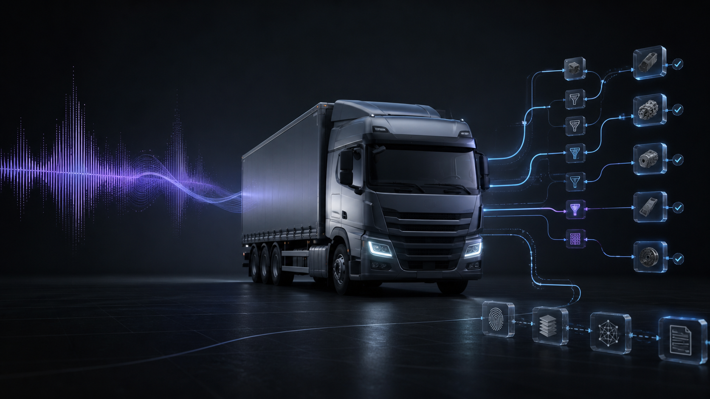
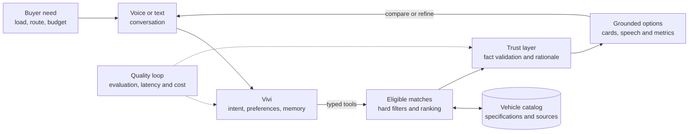

# Vivi: Voice-first Commercial Vehicle search

[](docs/EVALUATION.md)
[](docs/DATA_GENERATION.md)
[](docs/SETUP.md)
[](docs/TECHNICAL_DECISIONS.md#decision-3-deterministic-facts-with-optional-natural-rephrasing)
[](LICENSE)



Vivi is a conversational assistant for finding used commercial vehicles through voice or text. It turns natural requests into inspectable constraints, applies deterministic filters and ranking to a MotherDuck catalog, and validates vehicle facts before returning or speaking a recommendation.

## Highlights

- **Natural conversation:** understands budgets, payloads, vehicle sizes, fuels, body types, locations, corrections, and follow-up questions.
- **Grounded recommendations:** the model never writes SQL, and catalog facts are checked against returned records before they reach the user.
- **Inspectable decisions:** active filters, ranked results, ranking components, tool calls, model route, latency, tokens, and estimated cost are visible in the demo.
- **Resilient voice path:** Groq handles speech and model inference with bounded key and model rotation.
- **Executable evaluation:** 46 cases cover conversation, safety, catalog discovery, all vehicle sizes, body variants, attribute lookup, pagination, and preference changes.

## Quick start

You need [uv](https://docs.astral.sh/uv/), a MotherDuck token, and at least one Groq API key.

```powershell
Copy-Item example.env .env
# Add MOTHERDUCK__TOKEN and GROQ__API_KEYS to .env.

uv sync --all-packages --dev
uv run python -m vehicle_catalog_generator.load
uv run --package app streamlit run app/main.py
```

Open <http://localhost:8501>. The bottom composer accepts text or microphone input, and both modes share the same conversation state.

See the [setup guide](docs/SETUP.md) for prerequisites, credential links, every environment variable, troubleshooting, and verification commands.

## Try the conversation

Use these turns in one session:

1. `Chhota truck chahiye, 5 lakh ke andar, city delivery ke liye.`
2. `Nahi, diesel nahi, CNG.`
3. Ask for an impossible combination to see a grounded zero-result relaxation.
4. `Second one ka payload aur GVW kya hai?`

For a terminal-only conversation:

```powershell
uv run --package agents python analysis/agent_chat.py
```

## System overview



The buyer gets a natural conversation and comparable options; the application turns requirements into decision support; and deterministic search, typed tools, provenance, and response validation keep the underlying facts controlled. See the wiki for the detailed [component architecture](https://github.com/KayvanShah1/conversational-commercial-vehicle-search/wiki/Architecture-and-Technical-Decisions) and [conversation, tool, state, and grounding workflow](https://github.com/KayvanShah1/conversational-commercial-vehicle-search/wiki/Agent-Behavior-and-Grounding).

## Evaluation

| Suite | Coverage | Latest live result |
| --- | --- | ---: |
| Core | Conversation, intent, slots, safety, corrections, and follow-ups | **28/28 (100%)** |
| Vehicle variants | Sizes, bodies, fuels, categories, attributes, and pagination | **17/18 (94.4%)** |
| Combined | All executable cases | **45/46 (97.8%)** |

Both complete suites ran through the live agent and MotherDuck path on 2026-09-05 and exceeded the 90% target. Full commands, the detected miss, timings, token usage, and cost boundaries are in the [evaluation report](docs/EVALUATION.md).

## Tech stack

[](https://www.python.org/)
[](https://openai.github.io/openai-agents-python/)
[](https://streamlit.io/)
[](https://motherduck.com/)
[](https://duckdb.org/)
[](https://docs.pydantic.dev/)
[](https://groq.com/)
[](https://pola.rs/)
[](https://docs.astral.sh/uv/)
[](https://pytest.org/)

## Documentation

### Start here

| If you want to… | Read |
| --- | --- |
| Browse all repository documentation | [Documentation index](docs/README.md) |
| Install and run Vivi | [Setup guide](docs/SETUP.md) |
| Review the original specification | [Source brief](docs/assignment/README.md) or [PDF](docs/assignment/voice-search-assignment.pdf) |
| Understand the system boundaries | [Architecture and technical decisions](docs/TECHNICAL_DECISIONS.md) |
| Inspect scores and telemetry | [Evaluation report](docs/EVALUATION.md) |
| Check requirement coverage | [Submission checklist](docs/SUBMISSION_CHECKLIST.md) |
| Review catalog construction | [Catalog generation](docs/DATA_GENERATION.md) |
| Audit external references | [Sources and acknowledgements](docs/SOURCES.md) |
| Explore implementation detail | [Project wiki](https://github.com/KayvanShah1/conversational-commercial-vehicle-search/wiki) |
| View the evaluator walkthrough | [Presentation PDF](output/pdf/vivi-vehicle-search-presentation.pdf) |

The repository documentation is optimized for setup and assessment. The wiki contains deeper design, behavior, data-generation, evaluation, and operational explanations.

## Repository layout

```text
agents/                       Agent, tools, search, response, state and voice
app/                          Streamlit voice-and-text demo
vehicle-catalog-generator/    Reproducible synthetic catalog pipeline
utils/                        Shared settings, logging and database access
evals/                        Evaluation package, configuration and datasets
tests/                        Unit and opt-in integration tests
docs/                         Setup, design, evaluation and reference documentation
data/                         Generated catalog and evaluation artifacts
```

## Verify locally

```powershell
uv run ruff check agents app evals tests
uv run pytest -q
```

The live MotherDuck integration test is opt-in. See [Verification](docs/SETUP.md#verification) before enabling it.

## License

Licensed under the [MIT License](LICENSE).

### Disclaimer

<sub>This is an engineering demonstration, not a live marketplace or purchasing service. The catalog, prices, availability, rankings, and recommendations are synthetic and must not be treated as current commercial offers. Specification links provide provenance for selected reference attributes; confirm specifications, legal requirements, condition, pricing, and suitability with the manufacturer or seller before making a decision.</sub>

### AI-assisted development

<sub>AI tools supported implementation, refactoring, test design, documentation, and the repository cover image. Product scope, system boundaries, architecture, evaluation criteria, and final verification remained human-directed. AI-generated code and content were reviewed against executable tests, live evaluation cases, catalog-grounding checks, and the documented requirements.</sub>
