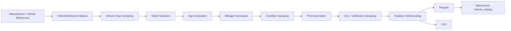
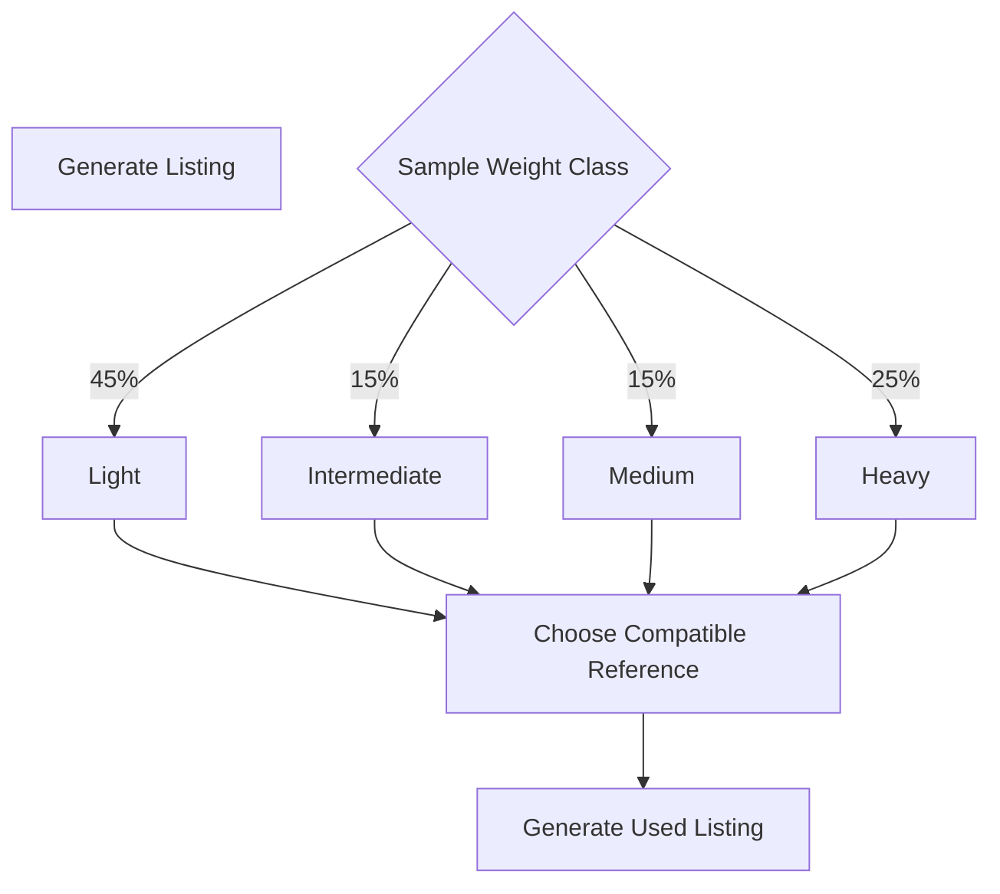
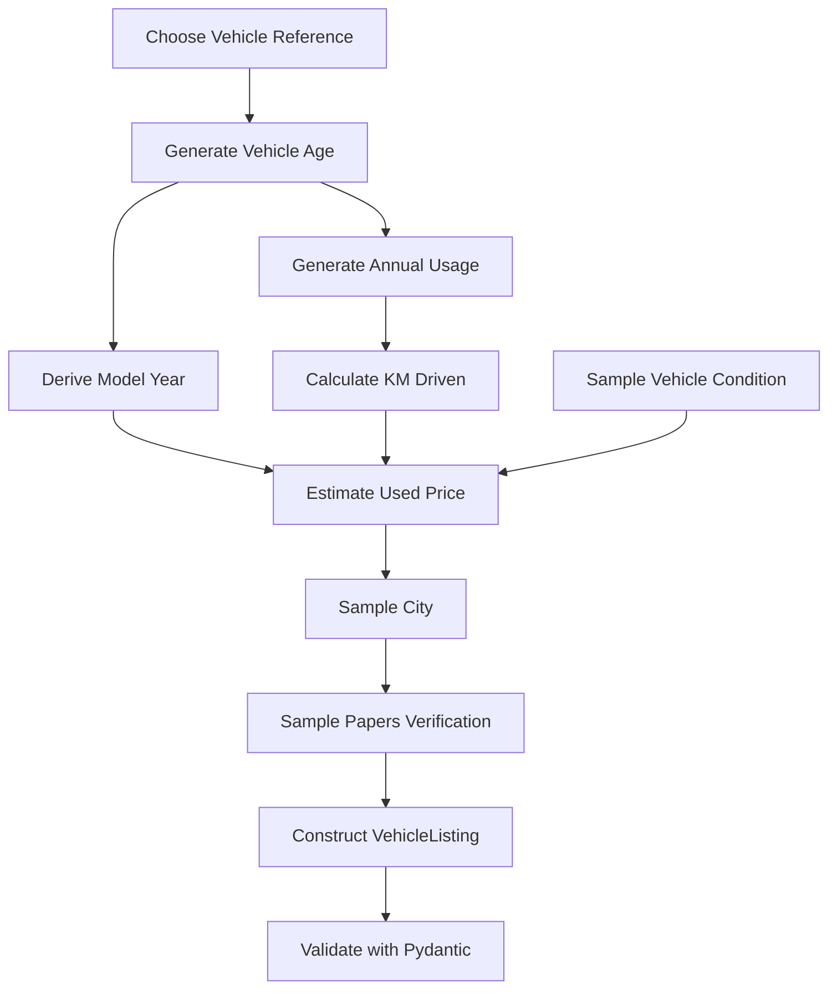
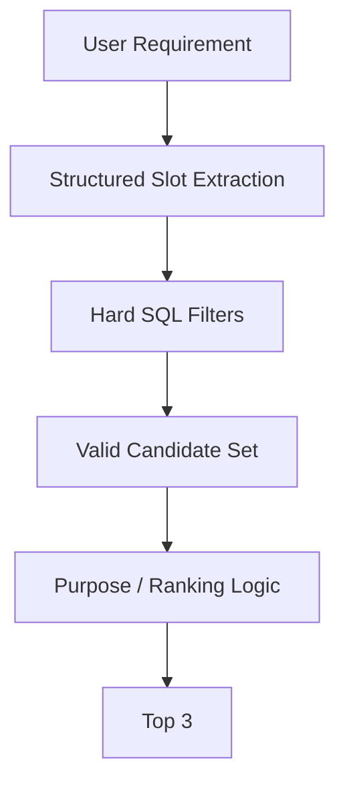
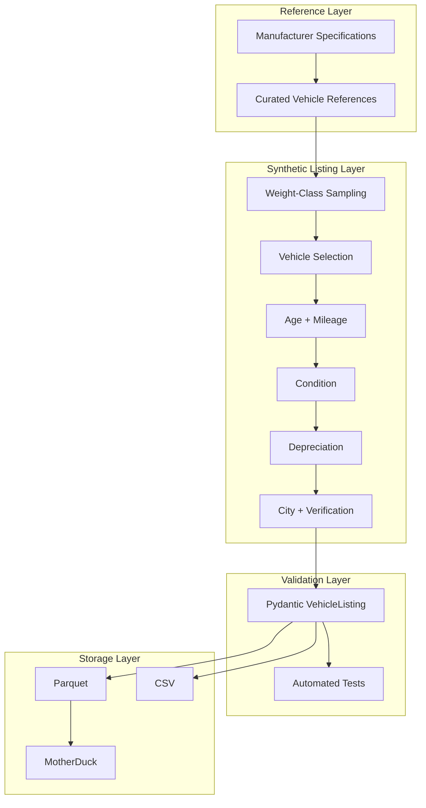

# Synthetic Commercial Vehicle Catalog Generation

## Overview

The vehicle search assistant needs a catalog large enough to exercise structured filtering, ranking, zero-result handling, conversational corrections, and evaluation scenarios without making external marketplace data a dependency of the system.

Instead of scraping live listings, this project generates a reproducible synthetic catalog from a curated set of real commercial-vehicle references.

The generated listings are synthetic, while important physical attributes such as vehicle class, GVW, payload, axle count, fuel type, and model family are anchored to manufacturer or other explicitly cited reference material where available.

This separation gives the search system realistic data relationships while keeping the catalog deterministic, inspectable, and safe to distribute with the project.

---

## Design Goals

The data-generation pipeline was designed around five requirements.

| Goal | Design decision |
|---|---|
| Realistic vehicle relationships | Generate listings from curated model references rather than independently randomizing every field |
| Reproducibility | Use a fixed random seed |
| Search diversity | Explicitly weight light, intermediate, medium, and heavy commercial-vehicle classes |
| Explainability | Keep generation parameters and price assumptions visible in code |
| Lightweight execution | Generate the complete dataset locally and write directly to Parquet/CSV before loading into MotherDuck |

The objective is not to accurately reproduce the Indian used-commercial-vehicle market.

The objective is to create a sufficiently realistic and diverse catalog for testing the behavior of the conversational search system.

---

# Architecture



The pipeline deliberately separates **reference data** from **generated listing data**.

A vehicle reference represents the relatively stable characteristics of a commercial-vehicle variant.

A generated listing represents one hypothetical used vehicle derived from that reference.

---

# Why Synthetic Data?

The assignment requires a catalog of at least 100 commercial-vehicle listings containing:

- make
- model
- year
- price
- kilometres driven
- fuel
- payload/GVW
- body type
- city
- papers-verification status

A live marketplace dataset was intentionally avoided for the initial implementation.

Scraping marketplace listings would introduce several unrelated concerns:

- unstable external pages
- incomplete fields
- inconsistent vehicle taxonomy
- duplicate listings
- missing payload/GVW information
- marketplace-specific schemas
- licensing and redistribution concerns
- additional data-cleaning work unrelated to the search problem

A synthetic catalog allows the search behavior itself to remain the focus of the implementation.

At the same time, purely random Faker-style generation would create unrealistic combinations such as unsupported fuel variants, impossible payload values, or body types inconsistent with a vehicle class.

The resulting approach is therefore a **reference-grounded synthetic generator** rather than unrestricted random generation.

---

# Reference Data

The core reference catalog is defined in:

```text
vehicle-catalog-generator/
└── src/
    └── vehicle_catalog_generator/
        └── reference_data.py
```

Each reference describes a real or representative commercial-vehicle configuration.

```python
VehicleReference(
    make="Tata",
    model="Ace Gold",
    fuel="CNG",
    vehicle_category=VehicleCategory.mini_truck,
    weight_class=VehicleWeightClass.light,
    body_type=VehicleBodyType.box,
    axle_count=2,
    payload_kg=660,
    gvw_kg=1630,
    new_vehicle_price_anchor_inr=650_000,
    purpose_tags=[
        "city_delivery",
        "last_mile",
        "fmcg",
        "vegetable_delivery",
    ],
    spec_source_url="...",
)
```

## Reference Attributes

| Attribute | Purpose |
|---|---|
| `make` | Manufacturer |
| `model` | Vehicle variant/model |
| `fuel` | Valid fuel configuration for the selected model |
| `vehicle_category` | High-level commercial-vehicle category |
| `weight_class` | Light/intermediate/medium/heavy classification used during sampling |
| `body_type` | Searchable body configuration |
| `axle_count` | Structural vehicle attribute |
| `payload_kg` | Payload where a defensible value is available |
| `gvw_kg` | Gross vehicle weight |
| `new_vehicle_price_anchor_inr` | Synthetic starting point for used-price generation |
| `purpose_tags` | Search/ranking hints for likely applications |
| `spec_source_url` | Source used when defining the vehicle reference |

---

# Vehicle Taxonomy

The generated catalog currently separates vehicles across several dimensions.

## Vehicle Category

```text
mini_truck
pickup
rigid_truck
```

## Weight Class

```text
light
intermediate
medium
heavy
```

## Body Type

```text
open
flatbed
box
container
tipper
tanker
reefer
```

This taxonomy provides considerably more search diversity than generating only small delivery trucks.

It also gives the conversational layer meaningful differences to reason over for queries such as:

- "small truck for city delivery"
- "something for construction material"
- "heavy truck for mining"
- "reefer vehicle for food transport"
- "pickup under ₹8 lakh"

---

# Vehicle-Class Distribution

The catalog intentionally does not sample all vehicle references uniformly.

A class is selected first:

```python
WEIGHT_CLASS_WEIGHTS = {
    VehicleWeightClass.light: 0.45,
    VehicleWeightClass.intermediate: 0.15,
    VehicleWeightClass.medium: 0.15,
    VehicleWeightClass.heavy: 0.25,
}
```

A compatible vehicle reference is then randomly selected from that class.



These weights are **demo-oriented synthetic assumptions**, not estimates of actual Indian commercial-vehicle market share.

The purpose is to ensure every searchable vehicle class has enough examples to exercise filtering and ranking behavior.

---

# Listing Generation

For every generated record, the pipeline performs the following sequence.



---

# Generated Listing Schema

The final search catalog contains:

| Field | Type | Source |
|---|---|---|
| `listing_id` | string | Generated |
| `make` | string | Vehicle reference |
| `model` | string | Vehicle reference |
| `year` | integer | Generated from age |
| `price_inr` | integer | Synthetic depreciation model |
| `km_driven` | integer | Age-dependent generation |
| `fuel` | string | Vehicle reference |
| `payload_kg` | integer/null | Vehicle reference |
| `gvw_kg` | integer | Vehicle reference |
| `vehicle_category` | enum | Vehicle reference |
| `weight_class` | enum | Vehicle reference |
| `body_type` | enum | Vehicle reference |
| `axle_count` | integer | Vehicle reference |
| `city` | string | Weighted synthetic sampling |
| `papers_verified` | boolean | Bernoulli sampling |
| `condition` | enum | Weighted synthetic sampling |
| `purpose_tags` | list[string] | Vehicle reference |

The schema contains all fields needed by the assignment while retaining several additional attributes useful for ranking and explainability.

---

# Mileage Generation

Mileage is correlated with vehicle age instead of being sampled independently.

The generator first chooses annual usage between configurable lower and upper bounds:

```text
8,000 km/year
to
35,000 km/year
```

The initial value is approximately:

```text
vehicle age × annual kilometres
```

A variance multiplier is then applied:

```text
0.75 – 1.25
```

Conceptually:

```text
km_driven =
    age
    × random_annual_usage
    × usage_variance
```

This introduces useful variability while preserving an important relationship:

> Older commercial vehicles should generally have accumulated more kilometres than newer vehicles.

Very young vehicles are handled separately with a low-mileage range.

---

# Condition Generation

Each vehicle receives one of three conditions:

| Condition | Sampling Weight | Price Effect |
|---|---:|---:|
| Excellent | 20% | 1.05× |
| Good | 55% | 1.00× |
| Fair | 25% | 0.88× |

Condition affects price without changing physical vehicle specifications.

This creates price variation between otherwise similar listings and gives the ranking layer another explainable attribute.

---

# Used-Price Generation

Used prices are generated from a configurable new-vehicle price anchor.

The price model intentionally remains simple and inspectable.


The effective calculation is approximately:

```text
price =
    new_vehicle_price_anchor
    × age_factor
    × mileage_factor
    × condition_factor
    × market_noise
```

## Age Depreciation

The current annual depreciation assumption is:

```text
10%
```

with a lower bound preventing old vehicles from depreciating indefinitely.

```text
minimum age factor = 0.30
```

## Mileage Adjustment

Higher-mileage vehicles receive an additional reduction.

The current mileage depreciation reference distance is:

```text
500,000 km
```

with:

```text
minimum mileage factor = 0.75
```

## Market Noise

A random market multiplier introduces listing-level price variation:

```text
0.92 – 1.08
```

## Price Rounding

Generated prices are rounded to:

```text
₹5,000
```

increments.

This produces values closer to marketplace-style asking prices and avoids artificially precise outputs such as:

```text
₹4,83,217
```

---

# City Distribution

Locations are generated using weighted sampling rather than uniform allocation.

Example weights include:

| City | Weight |
|---|---:|
| Mumbai | 14% |
| Delhi | 13% |
| Pune | 10% |
| Bengaluru | 10% |
| Ahmedabad | 9% |
| Hyderabad | 9% |
| Chennai | 8% |
| Kolkata | 7% |
| Surat | 6% |
| Jaipur | 5% |
| Indore | 5% |
| Nagpur | 4% |

These values are synthetic catalog assumptions.

Their purpose is to avoid an unnaturally uniform catalog while retaining enough inventory across several cities for location filtering and zero-result tests.

---

# Papers Verification

`papers_verified` is generated independently using a configurable probability.

Current default:

```text
82%
```

This is intentionally synthetic and should not be interpreted as a statement about the real commercial-vehicle market.

The attribute exists because document verification is required by the assignment's catalog schema and can also be used as a ranking signal.

---

# Purpose Tags

Each vehicle reference contains application-oriented tags such as:

```text
city_delivery
last_mile
vegetable_delivery
fmcg
construction
regional_delivery
industrial_goods
mining
coal
aggregates
ecommerce
```

These are not hard vehicle constraints.

Instead, they provide a controlled semantic layer between a user's stated business need and a vehicle's likely application.

For example:

```text
"chhota truck chahiye city delivery ke liye"
```

can be interpreted against vehicles carrying tags such as:

```text
city_delivery
last_mile
```

while hard constraints such as price, fuel, city, body type, payload, or GVW remain structured database filters.

This allows semantic relevance to influence ranking without allowing semantic similarity to override explicit user constraints.

---

# Configuration

Runtime-tunable generation settings are defined through `DataGenerationConfig`.

## Main Parameters

| Parameter | Default | Purpose |
|---|---:|---|
| `record_count` | `1000` | Number of generated listings |
| `seed` | `42` | Deterministic random generation |
| `replace` | `False` | Regenerate an existing dataset before load |
| `min_vehicle_age` | `1` | Youngest generated vehicle |
| `max_vehicle_age` | `12` | Oldest generated vehicle |
| `min_km_per_year` | `8000` | Minimum annual usage |
| `max_km_per_year` | `35000` | Maximum annual usage |
| `papers_verified_probability` | `0.82` | Verification probability |
| `output_filename` | `vehicles` | Generated dataset filename |

Additional generation constants such as depreciation, market noise, class weights, and condition factors are maintained in `reference_data.py`.

This distinction keeps:

- environment-level execution settings configurable
- domain-model assumptions explicit in source control

---

# Reproducibility

The generator seeds Python's pseudo-random number generator before producing records.

```python
random.seed(cfg.seed)
```

With the same:

- source code
- reference catalog
- generation settings
- random seed

the generated catalog is deterministic.

This property is particularly important for evaluation.

A test utterance should not suddenly return a different vehicle simply because the catalog changed between runs.

The repository includes an automated reproducibility test that generates the catalog twice and verifies that both results are identical.

---

# Data Validation

Pydantic models provide record-level type and constraint validation before output.

Examples include:

```text
price_inr > 0
km_driven >= 0
gvw_kg > 0
payload_kg > 0 when available
axle_count >= 2
```

The test suite additionally checks:

- complete condition configuration
- complete vehicle-class configuration
- weight distributions sum to `1.0`
- all defined vehicle classes are represented
- all defined body types are represented
- expected axle configurations exist
- source URLs exist for vehicle references
- catalog generation is reproducible
- generated class distribution remains close to configured weights
- Parquet output preserves list-valued purpose tags
- CSV output serializes purpose tags consistently

These tests guard the assumptions that directly affect downstream search behavior.

---

# Source Provenance

The catalog intentionally distinguishes between three kinds of information.

## Manufacturer-Grounded Attributes

Examples include:

```text
make
model
fuel
GVW
vehicle configuration
axle count
payload where published
```

Reference objects retain a `spec_source_url` pointing to the source used while defining the vehicle.

## Synthetic Generation Anchors

Some values exist only to make synthetic listings possible.

The most important example is:

```text
new_vehicle_price_anchor_inr
```

These values should not be interpreted as authoritative current manufacturer pricing.

They are inputs to the synthetic depreciation function.

## Derived or Estimated Attributes

Some commercial-vehicle specifications, particularly payload for heavier vehicles, may not be published directly on the referenced source.

Where an approximate or derived value is used, that assumption is documented alongside the corresponding reference in source code.

The system intentionally prefers a nullable payload with a valid GVW over manufacturing unsupported values solely to complete a field.

---

# Output Formats

The generator writes two representations.

```text
data/
└── generated/
    ├── vehicles.parquet
    └── vehicles.csv
```

## Parquet

Parquet is the canonical machine-readable output.

Advantages:

- preserves column types
- preserves `purpose_tags` as a list
- efficient DuckDB/MotherDuck ingestion
- compact storage
- no schema-inference ambiguity around list fields

## CSV

CSV is generated primarily for:

- quick human inspection
- debugging
- portability
- assessment review

Because CSV does not have a native list type, `purpose_tags` are serialized as:

```text
city_delivery|last_mile|fmcg
```

---

# MotherDuck Loading

The generated Parquet file is loaded into:

```text
Database: vehicle_catalog
Table: vehicles
```

The loader performs:

```sql
CREATE OR REPLACE TABLE vehicles AS
SELECT *
FROM read_parquet(?);
```

The resulting architecture is:


The catalog-generation path owns creation and replacement of the dataset.

The conversational agent is expected to access the catalog through a separate read-oriented search layer.

This creates a clear boundary:

```text
Catalog Generator → writes catalog
Agent/Search Layer → reads catalog
```

---

# Why Parquet + MotherDuck?

The local Parquet file gives the project a portable and reproducible artifact independent of any remote service.

MotherDuck provides a remotely accessible DuckDB-compatible query layer without requiring a full database server.

For the assignment's scale, either local DuckDB or MotherDuck is more than sufficient.

MotherDuck is used primarily to preserve a clean interface between:

```text
data generation
search
agent
```

rather than because the dataset requires distributed storage or computation.

---

# Why Not a Vector Database?

Most catalog constraints are structured:

```text
price <= ₹500,000
fuel = CNG
city = Mumbai
body_type = mini_truck
payload >= 750 kg
```

These constraints should behave as hard filters.

A vector database is therefore not used as the source of truth for catalog filtering.

Semantic matching may later be useful for softer attributes such as:

```text
purpose
usage pattern
business requirement
```

but semantic relevance must only rank records that already satisfy the user's hard constraints.

Conceptually:



This prevents semantic similarity from returning a vehicle that violates an explicitly stated budget, fuel, or location constraint.

---

# Why Not Use Faker for Everything?

Faker is useful when generating unconstrained attributes such as:

- names
- addresses
- phone numbers
- generic identifiers

Most fields in this catalog have domain relationships.

For example:

```text
model → fuel configuration
model → GVW
model → payload
model → axle configuration
model → likely applications
```

Independently generating these fields would make the dataset less realistic.

The generator therefore uses controlled randomness around curated vehicle references rather than generating each field independently.

The synthetic variation is concentrated in attributes that naturally vary across used listings:

```text
year
kilometres driven
condition
price
city
papers verification
```

---

# Assumptions and Limitations

This dataset is designed for system evaluation, not market analysis.

The following limitations are intentional.

### Market distribution is synthetic

Vehicle-class and city weights exist to provide search coverage. They do not estimate actual sales or listing distributions.

### Pricing is approximate

Used-vehicle prices are generated from a deliberately simple depreciation model.

The resulting prices are plausible search values, not vehicle valuations.

### Condition is synthetic

`excellent`, `good`, and `fair` are generated attributes and are not derived from inspection records.

### Papers verification is synthetic

The configured verification probability is purely a test-data assumption.

### Purpose tags are curated

Purpose tags represent plausible applications and support ranking experiments. They should not be interpreted as manufacturer-certified use restrictions.

### Payload coverage varies

Where an authoritative or defensible payload figure is unavailable, GVW may be retained without pretending an unsupported payload value is known.

---

# Testing Strategy

The generator test suite focuses on properties that can affect downstream search correctness.


Important checks include:

### Taxonomy coverage

Every expected vehicle class and body type should appear in the reference catalog.

### Distribution behavior

Large generated catalogs should approximately follow the configured class weights.

### Deterministic generation

Identical configuration and seed values should produce identical listings.

### Serialization integrity

Parquet should retain structured fields such as lists while CSV should preserve equivalent information in a portable representation.

---

# Example Generated Record

A generated listing may resemble:

```json
{
  "listing_id": "VEH-000127",
  "make": "Tata",
  "model": "Ace Gold",
  "year": 2021,
  "price_inr": 435000,
  "km_driven": 68421,
  "fuel": "CNG",
  "payload_kg": 660,
  "gvw_kg": 1630,
  "vehicle_category": "mini_truck",
  "weight_class": "light",
  "body_type": "box",
  "axle_count": 2,
  "city": "Mumbai",
  "papers_verified": true,
  "condition": "good",
  "purpose_tags": [
    "city_delivery",
    "last_mile",
    "fmcg",
    "vegetable_delivery"
  ]
}
```

The vehicle configuration comes from the selected reference.

The following attributes are generated:

```text
listing_id
year
price_inr
km_driven
city
papers_verified
condition
```

This distinction is important because it prevents random listing generation from modifying known physical characteristics of the selected vehicle variant.

---

# End-to-End Data Flow

