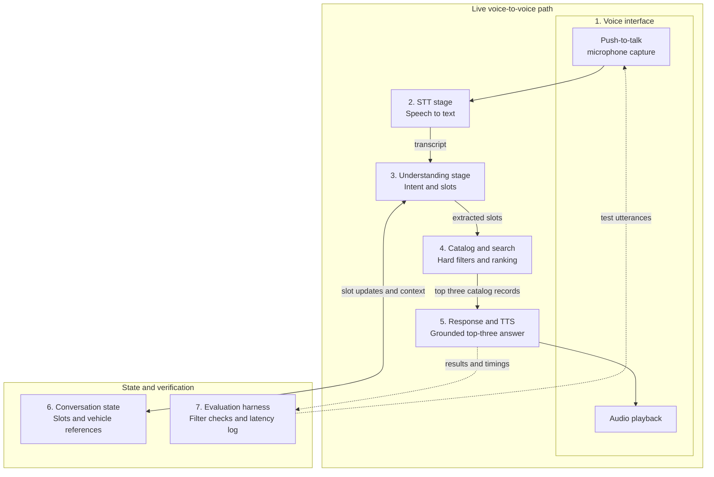

# Take-Home Assignment: Voice-Based Vehicle Search

> Build a working voice-search demo. Present the architecture. Defend the trade-offs.

This Markdown copy is provided for searchable review. The original supplied brief is preserved as [`voice-search-assignment.pdf`](voice-search-assignment.pdf).

## Assignment overview
- **Time budget:** Approximately 12–16 focused hours over 5–7 days
- **Submission deadline:** At least 24 hours before the presentation
- **Presentation:** 20-minute walkthrough and live demo, followed by approximately 10 minutes of Q&A
- **Scope:** A localhost demo is acceptable. Avoid gold-plating; the evaluation focuses on technical judgment, reliability, measurable results, and clearly explained decisions.

## 1. Task

Build a voice-first assistant that allows a buyer to find a used commercial vehicle by speaking naturally.

The live demonstration must support this core loop:

1. The buyer speaks a requirement, for example: _“Chhota truck chahiye, 5 lakh ke andar, city delivery ke liye.”_
2. The system transcribes the speech.
3. It extracts the buyer's intent and relevant slots:
   - Budget
   - Body type
   - Fuel
   - City
   - Purpose
4. It searches a vehicle catalog using real, enforceable filters.
5. It speaks back the top three results, with a reason for each result grounded in catalog data.

English is acceptable. Hindi or Hinglish support is a plus.

### Vehicle catalog

Create a synthetic catalog containing at least 100 listings. Each listing must include:

- Make
- Model
- Year
- Price
- Kilometres driven
- Fuel type
- Payload or GVW
- Body type
- City
- Papers-verified flag

A CSV file or SQLite database is sufficient.

## 2. Required components

All seven components may be lightweight, but each must exist as an identifiable part of the implementation and architecture diagram.

> The components may be connected in any way, and a single process is acceptable. However, every seam must remain identifiable because the presentation's and §5’s trade-off questions are asked per component.

### 2.1 Voice interface

A minimal web page or CLI that supports push-to-talk microphone capture and audio playback. Visual polish is not required, but it must work reliably during the live demonstration.

### 2.2 Speech-to-text stage

Convert spoken input to text using a vendor API or open-source model. The implementation may be streaming or file-based.

### 2.3 Understanding stage

Extract intent and slots using LLM function calling, rules, or another justified approach. The slot state must be inspectable on every turn.

Required slots:

- Budget
- Body type
- Fuel
- City
- Purpose

### 2.4 Catalog and search layer

Provide:

- A queryable synthetic catalog
- A filter builder that converts extracted slots into hard filters
- A ranking method for the remaining vehicles

### 2.5 Response and text-to-speech layer

Compose the spoken top-three response strictly from returned catalog records. The anti-hallucination mechanism belongs here. Pass the grounded response to text-to-speech.

### 2.6 Conversation state

Maintain slot state across turns so that:

- A correction updates only the intended slot, such as _“Nahi, diesel nahi, CNG.”_
- Follow-up questions understand references such as _“uska.”_

### 2.7 Evaluation harness and latency log

Build a script that:

- Runs at least 10 test utterances through the real pipeline
- Compares executed filters with expected filters
- Reports the pass rate
- Records per-turn and per-stage latency
- Measures speech-end-to-first-audio-back latency

The evaluators will run this harness.

## 3. Hard requirements

### 3.1 End-to-end voice flow

The complete path must work:

`Microphone → STT → Understanding → Search → Response → TTS → Audio playback`

Vendor APIs and open-source models are both acceptable, including free-tier services.

### 3.2 Hard constraint enforcement

User constraints are strict boundaries. For example, a buyer who asks for a vehicle under ₹5 lakh must never be presented with a ₹6 lakh vehicle.

The extracted slot state must be visible in logs or on screen so the evaluators can verify what the system understood.

### 3.3 Zero invented facts

Every factual value spoken by the assistant, including price, kilometres driven, payload, and year, must originate from the catalog.

A prompt instruction alone is not considered an enforcement mechanism. Be prepared to demonstrate the code-level guard, such as structured response generation, deterministic templates, output validation, or an equivalent mechanism, and explain its limitations.

### 3.4 Awkward conversational turns

The demonstration must handle:

- **Zero results:** State that no results were found and suggest a constraint that could be relaxed.
- **Mid-conversation correction:** Update one slot without restarting the conversation.
- **Follow-up question:** Answer at least one question about a previously returned vehicle.

### 3.5 Measurement

Report:

- End-to-end latency from speech end to first audio response
- Per-stage latency for STT, understanding, search, response generation, and TTS
- Results from at least 10 evaluation utterances with expected filters
- Overall evaluation pass rate

## 4. Optional stretch goals

Choose no more than two:

- Hinglish code-switching
- Noisy-audio robustness
- Streaming partial responses
- A reranker with explainable weights
- Cross-turn memory
- Estimated cost in rupees per conversation

## 5. Explicitly out of scope

- Authentication
- Payments
- Bookings
- Mobile applications
- Deployment and infrastructure

## 6. Presentation requirements
> 20 min + 10 min Q&A

### 6.1 Live demonstration
Demonstrate the complete voice-to-voice loop, including:

- A normal search
- A correction
- A zero-result case
- A follow-up question about a returned vehicle

### 6.2 Architecture diagram

Show all seven required components. For every component, explain:

- Why it was selected
- What complexity it hides
- What would replace it in a production system

### 6.3 Technical trade-offs

Present at least three decisions in this form:

1. The decision made
2. The alternative rejected
3. Why the chosen approach was more appropriate

Possible trade-offs include:

- Cascaded `STT → LLM → TTS` versus speech-to-speech
- Vendor APIs versus open-source models
- Search-engine choice
- Latency versus quality versus cost

### 6.4 Scale question

Explain what would break first at 100,000 conversations per month and what you would change, in order of priority.

## 7. Evaluation rubric

| Criterion | Points | What evaluators look for |
| --- | ---: | --- |
| Working end-to-end demo | 25 | The voice-to-voice loop runs live without hand-holding |
| Search correctness | 20 | Filters are honored, corrections work, and the evaluation pass rate is strong |
| Zero-hallucination discipline | 15 | A code-level enforcement mechanism with clearly stated limitations |
| Architecture reasoning and trade-offs | 20 | Decisions are defended against genuine alternatives |
| Latency awareness | 10 | Measured latency and understanding of where time is spent |
| Code quality and presentation clarity | 10 | Readable code, fast setup, and a clear walkthrough |
| **Total** | **100** | |

### 7.1 Scoring details

#### Working end-to-end demo: 25 points

| Score | Evaluation standard |
| ---: | --- |
| **22–25** | The complete voice-to-voice loop works on the first attempt, including correction and zero-result cases. |
| **15–21** | The flow works with one retry, or one stage temporarily falls back to an alternative such as typed input and recovers. |
| **8–14** | Only parts work live, or the demo relies on prerecorded audio or manual stitching. |
| **0–7** | No working path exists from spoken input to spoken output. |

#### Search correctness: 20 points

| Score | Evaluation standard |
| ---: | --- |
| **17–20** | Every constraint is honored, corrections update exactly one slot, and the evaluation pass rate is at least 90%. |
| **12–16** | Constraints are honored, with a 70–90% pass rate or a clumsy but correct correction flow. |
| **6–11** | An occasional constraint is missed but caught and acknowledged, or the pass rate is below 70%. |
| **0–5** | A budget, fuel, or city constraint is violated during the live demo. |

#### Zero-hallucination discipline: 15 points

| Score | Evaluation standard |
| ---: | --- |
| **13–15** | A code-level mechanism, such as an output validator or structured generation from records, is used and its limitations are precisely explained. |
| **8–12** | Grounding is implemented through structured prompts and response templates, with honest limitations. |
| **3–7** | Only untested prompt instructions are used. |
| **0–2** | The assistant invents a vehicle or factual value during the demo. |

#### Architecture reasoning and trade-offs: 20 points

| Score | Evaluation standard |
| ---: | --- |
| **17–20** | At least three decisions include genuinely considered rejected alternatives; cost and latency are quantified; the scale answer identifies a realistic first bottleneck such as serial LLM calls, session concurrency, or vendor rate limits. |
| **12–16** | The reasoning is sound, but some alternatives appear generic or post-hoc. |
| **6–11** | The implementation can be described, but the choices cannot be defended against alternatives. |
| **0–5** | The candidate cannot explain the submitted design during Q&A. |

#### Latency awareness: 10 points

| Score | Evaluation standard |
| ---: | --- |
| **9–10** | Per-stage latency is reported, the dominant stage is identified, and at least one mitigation was attempted. |
| **5–8** | Only one end-to-end number is reported, without a stage breakdown. |
| **0–4** | Latency is unmeasured, or the numbers do not hold during the live check. |

#### Code quality and presentation clarity: 10 points

| Score | Evaluation standard |
| ---: | --- |
| **9–10** | The project runs from the README within 10 minutes, all seven components are easy to find, and the presentation anticipates likely questions. |
| **5–8** | The project has minor setup or structural friction. |
| **0–4** | The evaluators cannot run the project or follow the walkthrough. |

### 7.2 Role bars

| Role | Expected bar | Evaluation emphasis |
| --- | --- | --- |
| Intern | A score of at least 60 with a working live demo is a strong result. | The live demo, evaluation harness, and curiosity during Q&A, including whether the candidate understands why the system fails when it fails. Deep trade-off analysis is a bonus, not an expectation. |
| Tech Lead | A score of at least 80, including at least 17/20 on architecture reasoning and trade-offs, is expected. | Strong architectural judgment is mandatory; a flawless demo with weak trade-off reasoning does not pass at this level. |

For the Tech Lead role, the Q&A may probe:

- Noisy audio
- A vendor outage during a conversation
- Operation at 200 concurrent sessions
- Cost in rupees per conversation

### 7.3 Automatic score caps

Any one of the following caps the total score at 40:

- A stated constraint is violated during the live demo and the candidate does not notice it.
- An invented vehicle or factual value is presented without a detection mechanism.
- The candidate cannot explain the submitted code.

### 7.4 Q&A prompts shared by Vyngo

1. _“Your STT misheard ‘Ace’ as ‘S.’ What happens downstream, and where would you catch it?”_
2. _“Why did you rank these three first? Show me the reason in data, not in prose.”_
3. _“Which component would you replace first in production, and what interface makes that replacement inexpensive?”_
4. _“Your latency is X ms. Where does most of it go, and what is the first 200 ms you would win back?”_

> These prompts are deliberately shared in advance: knowing the questions is not enough unless the system was built well.

## 8. Rules

- Any programming language or framework may be used.
- AI coding assistants are allowed and expected, but every submitted line of code must be explainable during Q&A.
- Cite borrowed repositories, tutorials, models, and other sources.

> Clarifying questions are welcome. Silent, incorrect assumptions may cost points.

## 9. Submission checklist

Submit the following at least 24 hours before the presentation:

- [ ] Repository link
- [ ] README that gets the project running within 10 minutes
- [ ] Synthetic vehicle catalog with at least 100 listings
- [ ] Evaluation dataset with at least 10 utterances and expected filters
- [ ] Evaluation results and pass rate
- [ ] Per-stage and end-to-end latency results
- [ ] Architecture diagram covering all seven components
- [ ] Presentation slides in PDF format
- [ ] At least three documented technical decisions and rejected alternatives
- [ ] Citations for borrowed material
