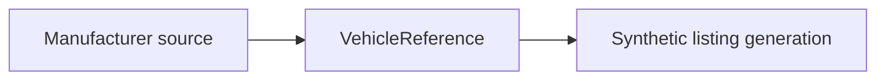

# Vehicle Catalog Generator

Generates a deterministic synthetic commercial-vehicle catalog in Parquet and CSV formats, exports its source-reference catalog, then optionally loads the listings into MotherDuck.

Generated artifacts:

```text
data/generated/
├── vehicles.parquet
├── vehicles.csv
└── vehicle_reference_catalog.csv
```

The listing artifacts contain only searchable vehicle data. `vehicle_reference_catalog.csv` separately records manufacturer URLs, generation price anchors, and whether a payload value is derived or estimated.

## Data provenance



- **Manufacturer-backed attributes:** linked through `spec_source_url` in the reference artifact.
- **Synthetic generation anchors:** `new_vehicle_price_anchor_inr` and the configured depreciation, mileage, condition, and market-noise assumptions create realistic demo prices; they are not authoritative market quotations.
- **Derived or estimated attributes:** `payload_is_estimated=true` identifies payload values inferred from related published specifications rather than directly published for the exact configuration.

Payload is retained only where a defensible reference value is available; GVW remains populated for all catalog records rather than manufacturing unsupported payload values. `payload_kg` therefore remains nullable in both the reference and listing models.

Run generation from the workspace root:

```powershell
uv run python -m vehicle_catalog_generator.generator
```

Load the catalog into MotherDuck:

```powershell
uv run python -m vehicle_catalog_generator.load
```

Copy `example.env` to `.env`, configure `MOTHERDUCK__TOKEN`, and set `DATA_GENERATION__REPLACE=true` when existing generated files should be replaced before loading.
